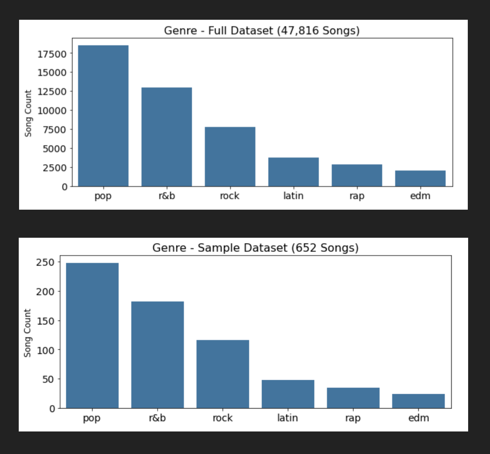
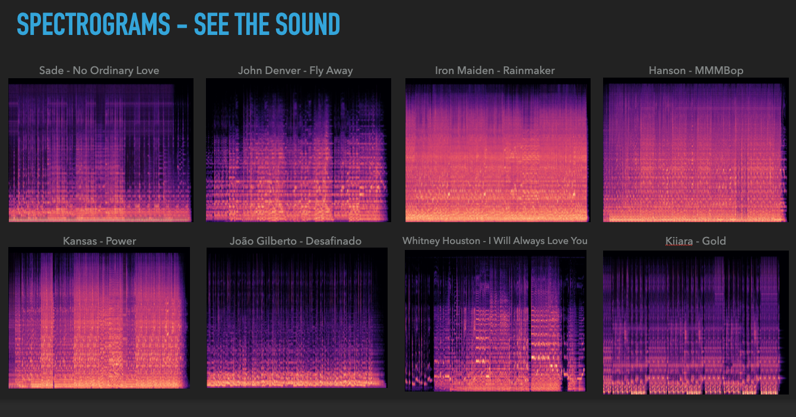
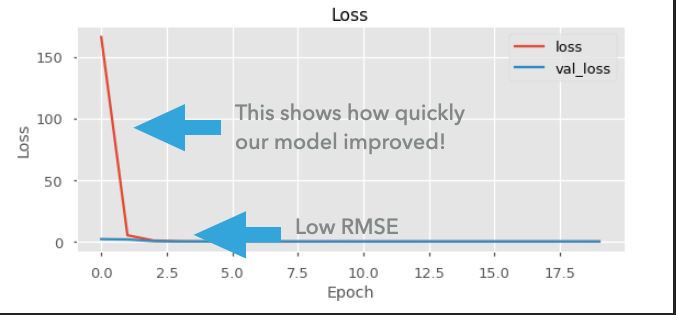

# Flatiron - Capstone Project by Vi Bui
# DISCO DUO 
## Building Deep Nueral Networks using music data and Tensorflow to predict metrics such as danceability

# Overview

**Client:** Existing or new music streaming services. Existing: Spotify, Pandora, Amazon Music, etc. New: companies interested in building new platforms to connect people through music. 

**Objective:** Create a platform where listeners of the same song are connected and able to discover new songs through their “connector song” by requesting another song based on a musical metric such as: danceability, loudness, acousticness, valence, etc.
 
**Data, Methodology, and Models**   

**Data source**: Spotify 
1. Spotify Song Data - https://www.kaggle.com/akiboy96/spotify-dataset
2. Spotify Genre Data - https://www.kaggle.com/code/akiboy96/spotify-song-popularity-genre-exploration/data?select=genre_music.csv

**Methodology:** Pull sample from data; create spectrogram images for songs; train model to predict danceability 

**Models:** Sequential Models 
1. Layers
2. Stochastic 
3. Add layers

**Target for first model: danceability**  
danceability: A value of 0.0 is least danceable and 1.0 is most danceable. Danceability describes how suitable a track is for dancing based on a combination of musical elements including tempo, rhythm stability, beat strength, and overall regularity.

 

## BUSINESS VALUE
Connect people through music in a new way // connect people in a new way through music

  

## OBSERVATIONS ABOUT THE DATA
Danceability is most strongly correlated with valence (happiness), popularity, loudness, and energy

 

**Sample dataset had proportionately more Rock songs than the full dataset**

 

# Methodology 
## Spectrograms were used as images to model the data

# Models & Metrics 
## We ran three models and used RMSE (root mean square error), which tells us how close our models' predicted ratings are to actual danceability. 

 
While all models showed strong results and predictions, we chose Model 3, which had the best RMSE of of 0.0214, meaning our predictions, on average, were 0.0214 points away from actual danceability measure (range: 1-10). 

 

 

 # **RESULTS & RECOMMENDATIONS** 

## Summary of recommendations

* All three Sequential Models performed well, and we feel most confident with Model 3
* With Model 3's RMSE (root mean squared error) = loss: 0.0214 - val_loss: 0.0183, our model shows it will be a strong predictor of "danceability" of songs 
* We will use the same approach in our Future Work with other metrics in the dataset 

 

## **FUTURE WORK**
* Run models for all remaining metrics: 
1. Energy
2. Speechiness
3. Acousticness
4. Instrumentalness
5. Liveness
6. Valence 
 
* Build platform to connect users listening to the same song and apply Disco Duo
 
* Expand ways to use Disco Duo (game night, silent discos, etc.)
 
**THANK YOU!!**

# Repository Structure

- Images 
- gitignore
- README.me
- Vi_Bui_Capstone_Presentation.key
- Vi_Bui_Capstone_Presentation.pdf
- Vi_Bui_Capstone_Submission_Jupyter Notebook.pdf
- Vi_Bui_Capstone_Submission.ipynb
- viiiiiiiiiii_Flatiron_Capstone_Final_Vi_Bui.pdf
